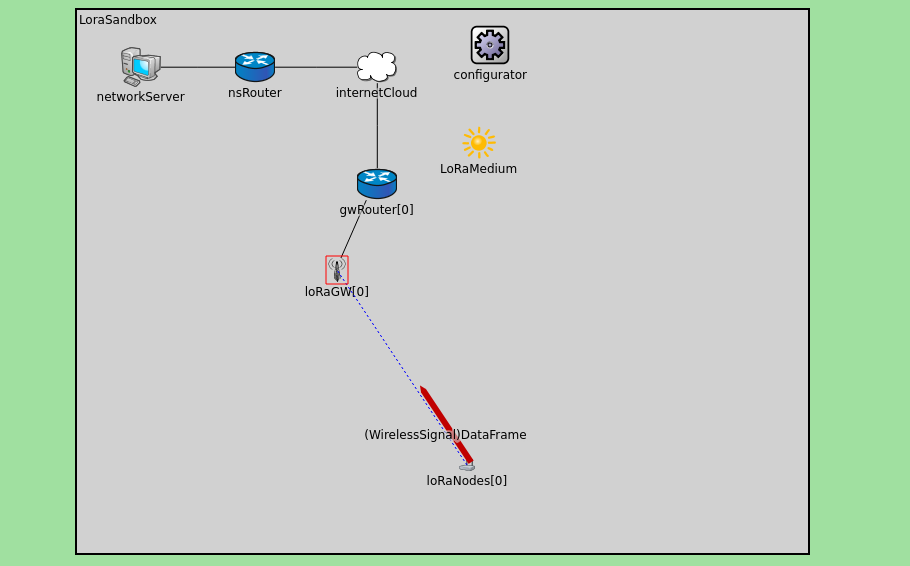

## Progetto Industrial IoT
(*Provvisorio*) Creare uno stack "blended" di simulazione ed emulazione di un ambiente LoRa, raccogliendo dati relativi a possibili scenari e documentando le potenzialità ed i limiti degli ambienti utilizzati.

### Immagini

### Roadmap (provvisoria)

 - Impostazione di un ambiente base di simulazione in Omnet++ [[5ca8fb7](https://github.com/Hikari1026/Iot_project/commit/5ca8fb77ed623a608df72de1adbc4331552bbba6)]
